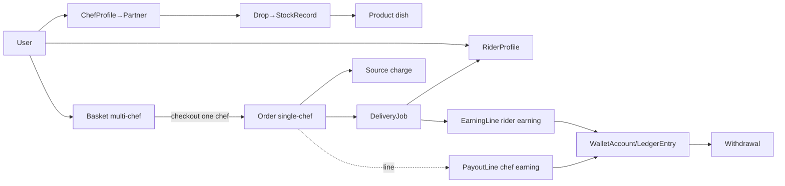
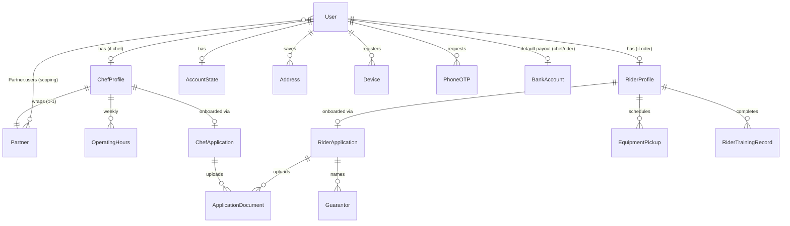
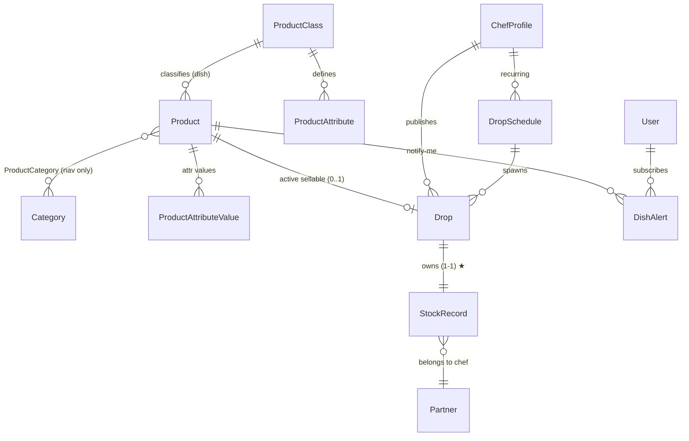
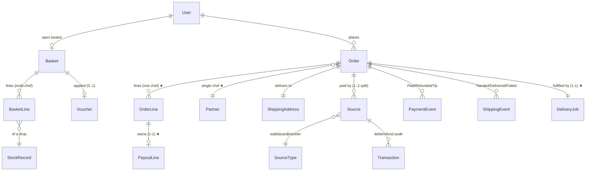
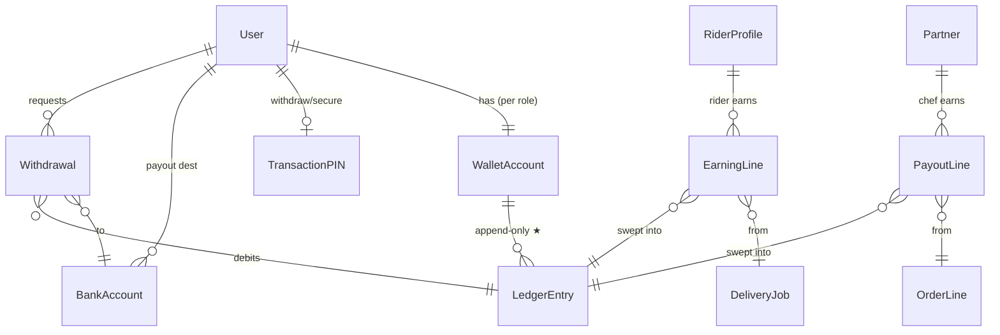
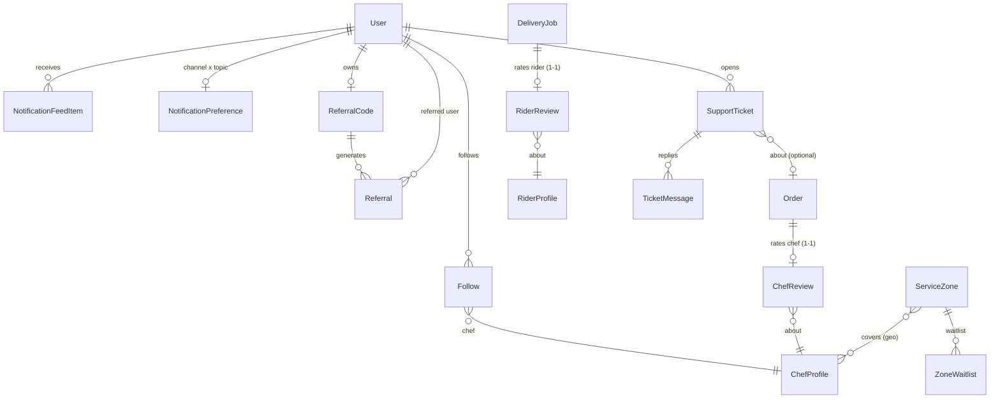
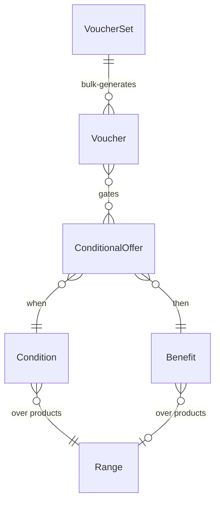

# HomeChow Data Model Reference (ERD)

Status: **draft — review alongside plan v3**
Source: `backend-implementation-plan.md` §5 (field lists per module) + the
ADRs. This is the cross-module view the per-module field lists can't give
you — it exists to catch relationship mistakes *before* migrations exist.

Reading guide:
- **Oscar core** entities are used as-is (pinned dependency); shown only
  where domain models attach to them. Forked apps (ADR manifest) change
  *behaviour*, not these schemas — `models_diverged: false` everywhere.
- `1—1` one-to-one, `1—N` one-to-many, `N—1` FK, `N—N` many-to-many.
- ★ marks the load-bearing joins (the ones a wrong cardinality would
  corrupt the money path or scoping).

---

## 0. The shape in one paragraph

A **User** (phone-first, `AUTH_USER_MODEL`) may own a **ChefProfile**
(which wraps an Oscar **Partner**) and/or a **RiderProfile**. A chef
publishes **Drops**; each Drop owns exactly one Oscar **StockRecord** for
one **Product** (`dish`). Customers fill one **Basket** (multi-chef,
grouped), then check out **one chef group at a time** → one single-chef
**Order** (Oscar), one **Source** charge, one **DeliveryJob** worked by a
**RiderProfile**. Money out flows two ways: chef earnings via **PayoutLine**
(one per order line), rider earnings via **EarningLine** (per job); both
land in a **WalletAccount** as append-only **LedgerEntry** rows and leave
via **Withdrawal**. Engagement (**Follow**, **DishAlert**, **Referral**),
**ChefReview**/**RiderReview**, **SupportTicket** and **ServiceZone** hang
off the edges.

---

## 1. Identity & profiles

Key points:
- ★ **ChefProfile 1—1 Partner.** The Partner is Oscar's vendor anchor;
  ChefProfile is the related model (ADR-008) so Partner stays undiverged.
  `Partner.users` (M2M) carries the chef's user for `services/scoping.py`
  even though chef dashboard logins are off at MVP (ADR-010).
- **User 1—1 ChefProfile / RiderProfile** are *optional* — most users are
  customers only; a chef who orders dinner is just a customer on those
  endpoints. Role = "profile exists and is active", never a user flag.
- `ApplicationDocument` is shared by both application types via an abstract
  base (`kind` enum distinguishes id/selfie/licence/kitchen-photo/etc.);
  files live in a **private** bucket with configurable retention
  (`HOMECHOW_KYC_RETENTION`).
- `AccountState` (suspended/strikes) is a 1—1 satellite, not user fields —
  keeps user-model migrations rare (ADR-001 anti-pattern note).

---

## 2. Catalogue & drops

Key points:
- ★ **Drop 1—1 StockRecord.** This is the bridge that lets Oscar's
  allocation maths (`num_in_stock` / `num_allocated`, allocate-at-placement,
  consume-at-handoff, release-on-cancel) power the "X portions left"
  countdown for free (ADR-004/005). The strategy
  (`HomeChowStrategy.select_stockrecord`) returns *only* a currently
  sellable drop's stockrecord.
- **Product 0..1 active Drop** is an *invariant enforced at publish time*,
  not a DB constraint: one product may have many historical drops but at
  most one sellable now. (`Drop.status` + the publish guard.)
- **Categories are navigation only** (Oscar rule); offer targeting uses
  **Range** (§5). `dietary`/`cuisine` are `multi_option` attributes, not
  categories — that's what makes them facetable in the SearchGateway.
- Portion-size "variants" are **separate Products/Drops**, not Oscar
  parent/child (ADR-004 — standalone only).

---

## 3. The money path — basket → order → payment → fulfilment

Key points:
- ★ **Order N—1 Partner (single chef).** Every order has exactly one chef
  (ADR-007) — checkout extracts one basket group at a time. This is what
  keeps delivery, statuses, payouts and refunds one-dimensional and the
  `Order 1—1 DeliveryJob` relationship clean.
- ★ **Order 1—1 DeliveryJob.** One order = one delivery = one rider = one
  tracking timeline. (A multi-chef basket becomes N orders across N
  checkouts, hence N jobs — never one job spanning chefs.)
- **Source / Transaction / PaymentEvent** are Oscar's money model
  (ADR-009): wallet leg + optional card leg = 1–2 Sources per order,
  `amount_debited` (one-phase charge), refunds as negative Transactions +
  `Refunded` payment events through the EventHandler. No order has a
  parallel creation path — placement is `SubmissionService` only.
- ★ **PayoutLine 1—1 OrderLine** with the commission rate **frozen at
  placement** (created by the `order_placed` receiver). Chef earnings derive
  only from these auditable rows, never from `order.total_*`
  (`oscar-marketplace` anti-pattern).
- `ShippingEvent`s are the PIN-handoff bridge: `Handed to rider` →
  `Out for delivery`, `Delivered` → flips PayoutLines to `payable`.

---

## 4. Wallets, payouts, earnings (money in / money out)

Key points:
- ★ **Balances are never stored.** A `WalletAccount` balance is the sum of
  its `LedgerEntry` rows (append-only, each with a unique
  `idempotency_key`), cached with invalidation. This is the single source
  of truth a double-topup webhook replay or a double-submit cannot corrupt.
- **Two earning streams, one ledger:** chef `PayoutLine`s (pending →
  payable on `Delivered` → swept to a `LedgerEntry(kind=earning)`) and
  rider `EarningLine`s (base/distance/surge/tip) both terminate as ledger
  credits. `Withdrawal` (PIN-gated, Paystack transfer) is a ledger debit
  confirmed by webhook.
- **WalletAccount is per (user, role).** A user who is both customer and
  chef has separate customer and chef wallets — earnings and spend don't
  commingle.
- The wallet also acts as an Oscar **SourceType** at checkout (§3) — the
  same ledger, debited as a payment Source.

---

## 5. Engagement, reviews, support, zones

Key points:
- ★ **ChefReview 1—1 Order, RiderReview 1—1 DeliveryJob.** Reviews are
  *operator* reviews tied to a completed fulfilment — a different contract
  from Oscar's per-product reviews (hidden, ADR-014). One review per
  delivered order; aggregates denormalize onto the profiles via task.
- **Follow + DishAlert replace the wishlist** (ADR-014): drop publish fans
  out to `Follow`ers and `DishAlert` holders, writing `NotificationFeedItem`
  rows and dispatching per `NotificationPreference` (the comms matrix).
- **Referral**: signup-with-code creates a `Referral`; first `Delivered`
  order triggers a voucher from a **VoucherSet** (Oscar offers, §6) to the
  referrer.
- **ServiceZone** (PostGIS polygon) gates address creation and checkout
  deliverability, and aggregates the rider demand heatmap.

---

## 6. Offers & vouchers (Oscar engine, untouched)

Promotions and referral rewards live entirely in Oscar's conditional-offers
engine (`oscar-offers-vouchers`) — no custom discount code anywhere:

- Promo codes (screen #45) = `Voucher` add/remove on the basket.
- Referral rewards + loyalty campaigns = `VoucherSet`.
- Free-delivery promotions = a **shipping Benefit** (not a shipping
  method) so they stay capped and audited (`oscar-shipping` Recipe 5).
- `Range` is the only business grouping of products; **Category is never
  used for offer logic** (Oscar rule).

---

## 7. Entity ownership map (where each table's code lives)

| Cluster | App | Migration owner |
|---|---|---|
| User, PhoneOTP, Device, Address, AccountState | `domain/users` | own |
| ChefProfile, OperatingHours, ChefApplication, ApplicationDocument | `domain/chefs` | own |
| RiderProfile, RiderApplication, Guarantor, EquipmentPickup, training | `domain/riders` | own |
| Drop, DropSchedule, DishAlert | `domain/drops` | own |
| DeliveryJob, JobOffer, RiderShift, LocationTrail, EarningLine, SOSEvent | `domain/logistics` | own |
| WalletAccount, LedgerEntry, BankAccount, TransactionPIN, Withdrawal | `domain/wallets` | own |
| PayoutLine | `domain/payouts` | own |
| Follow, NotificationFeedItem, NotificationPreference, Referral(Code) | `domain/engagement` | own |
| ChefReview, RiderReview | `domain/reviews` | own |
| SupportTicket, TicketMessage, OrderIssue, FAQ | `domain/support` | own |
| ServiceZone, ZoneWaitlist | `domain/zones` | own |
| Product, ProductClass, attributes, Category, Range | Oscar `catalogue`/`offer` | Oscar (+ `bootstrap` seed) |
| Partner, StockRecord | Oscar `partner` | Oscar |
| Basket, (basket) Line | Oscar `basket` | Oscar |
| Order, (order) Line, Shipping/PaymentEvent | Oscar `order` | Oscar |
| Source, SourceType, Transaction | Oscar `payment` | Oscar |
| ConditionalOffer, Voucher, VoucherSet | Oscar `offer`/`voucher` | Oscar |
| CommunicationEventType, Email | Oscar `communication` | Oscar (+ `bootstrap` codes) |

Conformance rule (import-linter, `oscar-architecture`): project code never
imports `oscar.apps.<forked-app>.models` directly — it uses the forked
app's models. The forked apps (partner/basket/checkout/shipping/order/
dashboard) add no new tables (`models_diverged: false`), so the ERD above
is the whole persistent schema.
