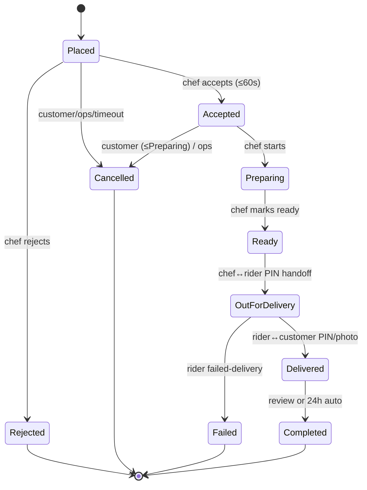
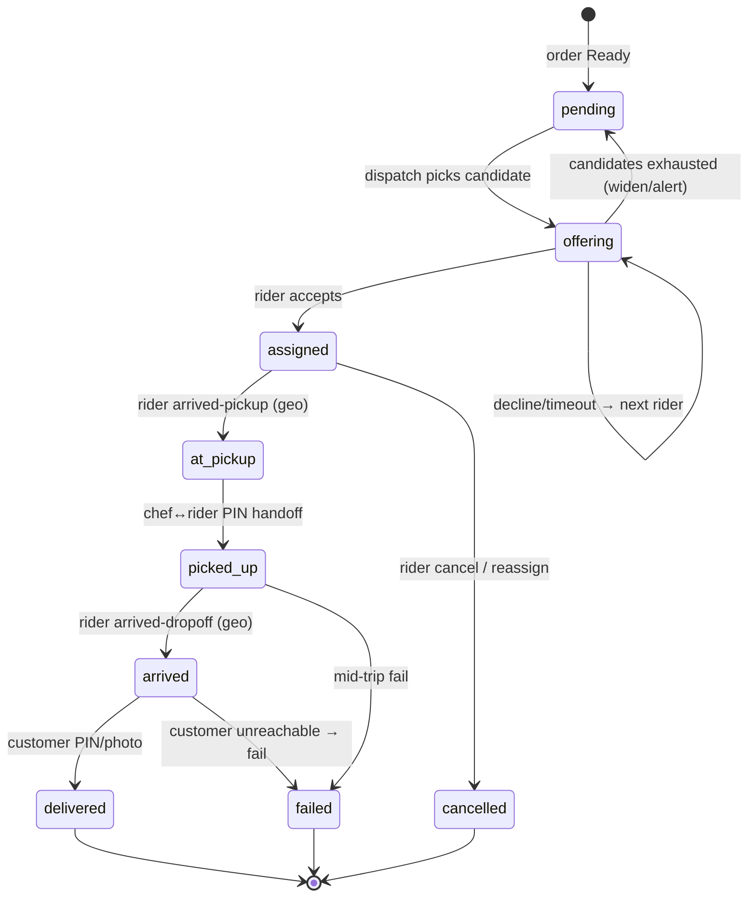
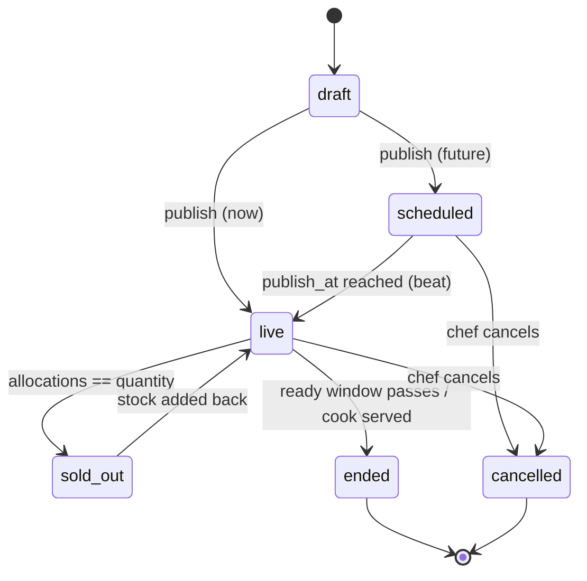
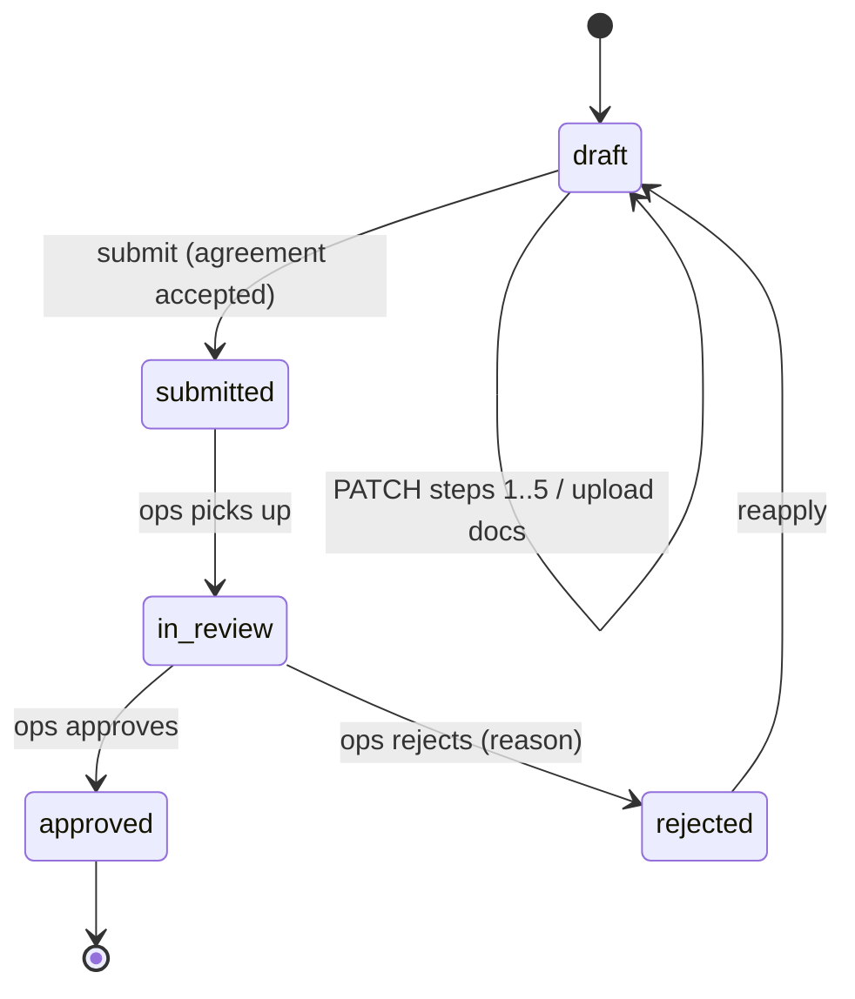
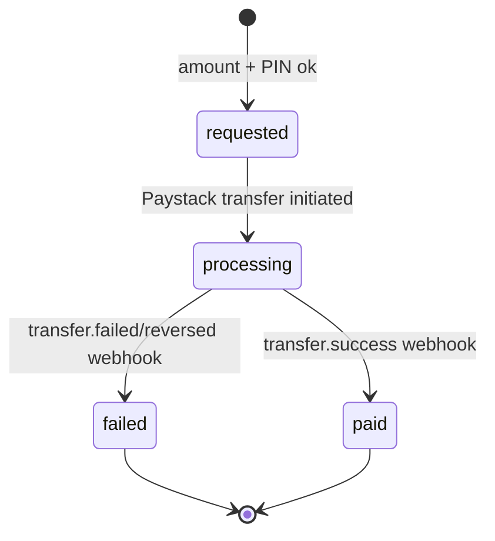

# HomeChow State-Machine Reference Card

Status: **draft — review alongside plan v3**
Source: ADR-006 (order pipeline), plan §5.1.5 / §5.2.4 / §5.2.5 / §5.2.6.
Purpose: the five machines that *are* the product, on one page, so backend,
mobile and ops share identical vocabulary. State names are customer- or
operator-visible copy — renaming any of them after launch is a data
migration over live rows.

Universal rule (ADR-006): **every order/line transition goes through
`set_status` / the forked `EventHandler`** — never a raw `status =` write.
The other machines (Drop, Job, Application, Withdrawal) transition through
their owning service, never ad-hoc.

---

## 1. Order (Oscar pipeline — `OSCAR_ORDER_STATUS_PIPELINE`)

| Transition | Trigger (who/what) | Guard | Side-effects (all enqueued) |
|---|---|---|---|
| → Placed | `SubmissionService` after charge | oversell guard passes; payment captured | `order_placed`: `dispatch.create_job` (PINs, fare quote), PayoutLines(pending), `NEW_ORDER` push+sound, `ORDER_PLACED` comms, 60s accept timer |
| Placed → Accepted | chef API `accept` | within 60s window | cancel timer; `ORDER_ACCEPTED` push; **gig fan-out** (`dispatch.start_offers`, `HOMECHOW_DISPATCH_TRIGGER="accept"` — travel overlaps prep) |
| Placed → Rejected | chef API `reject {reason}` | — | release allocations; **recall rider** (`cancel_job_for_order`); **full refund** (wallet instant / card Paystack); `ORDER_REJECTED`; restock drop |
| Placed/Accepted → Cancelled | customer cancel / ops / accept-timeout | status ≤ Accepted (or pre-order window) | `cancel_stock_allocations`; **recall rider** (safe — pre-handoff, no food in transit); full refund to chosen dest; `ORDER_CANCELLED`; note |
| Accepted → Preparing | chef API `start-preparing` | — | — |
| Preparing → Ready | chef API `ready` | — | `comms.on_order_ready`; gig fan-out **fallback** if no rider was found at accept (or `HOMECHOW_DISPATCH_TRIGGER="ready"`) |
| Ready → OutForDelivery | `handoff.verify` (chef enters rider PIN/QR) | PIN matches; ≤5 attempts | **`handle_shipping_event("Handed to rider")`**; `consume_stock_allocations`; `ORDER_OUT_FOR_DELIVERY` push (reveals delivery PIN) |
| OutForDelivery → Delivered | `handoff.verify` (customer PIN / photo) | PIN matches | **`handle_shipping_event("Delivered")`**; PayoutLines → `payable`; `ORDER_DELIVERED` + receipt |
| OutForDelivery → Failed | rider `fail {reason, photo, routing}` | photo present | ops ticket; refund/redeliver decision queue; earnings note |
| Delivered → Completed | review submit OR 24h beat | — | chef `CHEF_DAILY_SUMMARY` accrues; close order |

Notes: `OSCAR_LINE_STATUS_PIPELINE` mirrors this and `OSCAR_ORDER_STATUS_CASCADE`
maps order→lines (safe because single-chef, ADR-007; documented cascade
caveat accepted). Illegal transitions raise `pipeline_violation` (409).

---

## 2. DeliveryJob (`domain/logistics`)

| Transition | Trigger | Guard | Side-effects |
|---|---|---|---|
| → pending | order reaches Ready | order Accepted+ | PINs generated (hashed); fare quoted (zone tariff + surge) |
| pending → offering | `dispatch` candidate ranking | online active riders in radius | `GIG_OFFER` (WS + FCM), 15s `JobOffer` |
| offering → assigned | rider `accept` | offer not expired; first-accept wins (redis lock) | `RIDER_ASSIGNED` to customer; rider card appears on tracking |
| offering ↺ | decline / 15s timeout | — | next candidate; exhausted → widen radius, ops alert |
| assigned → at_pickup | `arrived-pickup` | within geofence of kitchen | chef `RIDER_ARRIVING` banner |
| at_pickup → picked_up | chef confirms rider PIN | PIN ok | **bridges Order → OutForDelivery** (§1) |
| picked_up → arrived | `arrived-dropoff` | within geofence of address | — |
| arrived → delivered | customer PIN / proof photo | PIN ok or photo present | **bridges Order → Delivered**; EarningLines (base/distance/surge) |
| arrived → failed | `fail` after unreachable timer | photo present | **bridges Order → Failed**; routing return-to-chef/base |
| assigned/picked_up → cancelled/failed | rider cancel / mid-trip issue | reason present | acceptance-rate impact; reassign or ops |

`JobOffer` sub-machine: `offered → accepted | declined | timeout` (15s TTL).

---

## 3. Drop (`domain/drops`)

| Transition | Trigger | Guard | Side-effects |
|---|---|---|---|
| draft → live/scheduled | chef `POST /chef/drops` | dish active; no other sellable drop for product; qty ≤ max; kitchen open | create StockRecord(num_in_stock=qty); follower + DishAlert fan-out (`DROP_ALERT`) |
| scheduled → live | beat at `publish_at` | — | fan-out if not already sent |
| live → sold_out | allocation hits qty | — | `drop.sold_out` WS; availability flips to SOLD OUT |
| sold_out → live | chef adds qty (`PATCH`) | — | `drop.tick` WS |
| live → ended | ready/cook window passes (beat) | — | drop closes for ordering |
| live/scheduled → cancelled | chef `cancel {reason}` | — | `cancel_stock_allocations`; **auto-refund every affected order** via `EventHandler.cancel`; notify buyers |

Availability copy (strategy-owned, drives screens #16–18) derives from this
state + stockrecord — see ADR-005 / plan §5.1.1.

---

## 4. KYC Application (chef & rider share the shape)

| Transition | Trigger | Guard | Side-effects |
|---|---|---|---|
| draft (steps) | applicant PATCH / document upload | step order; required docs | identity docs → `IdentityVerificationService` (pluggable; default `ManualReviewProvider` → ops queue, ADR/§5.4); bank step → Paystack resolve |
| draft → submitted | applicant `submit` | all steps complete; agreement accepted | enters ops KYC queue |
| submitted → in_review | ops opens | — | — |
| in_review → approved | ops approve | docs verified | **onboarding service**: chef → create Partner + `Partner.users` + Chefs group + ChefProfile(active) + `CHEF_APPROVED`; rider → RiderProfile(active) + `RIDER_APPROVED` + equipment-pickup unlock |
| in_review → rejected | ops reject `{reason}` | — | `CHEF_REJECTED`/`CHEF`… comms; reapply path |
| rejected → draft | applicant reapply | — | reset editable |

Document retention follows `HOMECHOW_KYC_RETENTION` (configurable; purge
beat job) regardless of outcome.

---

## 5. Withdrawal (`domain/wallets`)

| Transition | Trigger | Guard | Side-effects |
|---|---|---|---|
| → requested | chef/rider `POST …/withdrawals {amount, pin}` | amount ≤ available balance; PIN ok (≤5 attempts then lock); `Idempotency-Key` | `LedgerEntry(kind=withdrawal)` debit (holds funds) |
| requested → processing | transfer worker | bank account verified | Paystack Transfer, idempotent reference |
| processing → paid | `transfer.success` webhook | signature + replay-idempotent | `WITHDRAWAL_PAID` push/SMS; reference stored |
| processing → failed | `transfer.failed/reversed` | — | reverse the ledger debit (re-credit); ops alert; user notified |

---

## 6. Cross-machine handshakes (the joins that bite)

The PIN handoffs are where two machines move together — get the ordering
wrong and you either ship unpaid food or strand a paid order:

1. **Chef→Rider PIN** advances *both* `DeliveryJob: at_pickup → picked_up`
   **and** `Order: Ready → OutForDelivery` (via `handle_shipping_event`),
   and consumes stock allocations — in one transaction.
2. **Rider→Customer PIN/photo** advances `DeliveryJob: arrived → delivered`
   **and** `Order: OutForDelivery → Delivered`, and flips `PayoutLine`s to
   `payable` — in one transaction.
3. **Drop cancel** fans out to *every* affected `Order`, each running the
   full `EventHandler.cancel` (release allocations + refund) — not a bulk
   status write.

These three are the integration tests that gate M4 (plan §9): a PIN handoff
must advance the Oscar order status, not just the job.
